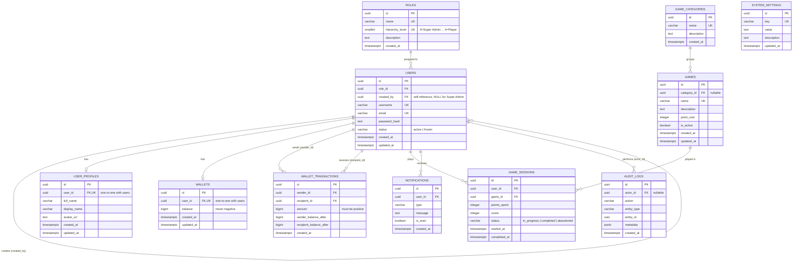

# ER Diagram

## Current Status

Complete — generated directly from the applied schema (`server/database/migrations/000`–`011`, `server/database/schema.sql`).

## Database Overview

11 tables, all with UUID primary keys (`gen_random_uuid()`), grouped into three areas:

- **Identity & hierarchy** — `roles`, `users`, `user_profiles`
- **Point economy** — `wallets`, `wallet_transactions`
- **Gameplay & platform** — `game_categories`, `games`, `game_sessions`, `notifications`, `audit_logs`, `system_settings`

## Entity Relationship Diagram

`system_settings` has no foreign key relationships to any other table — it is a standalone key-value store.

## Hierarchy Explanation

`users.created_by` is a self-referencing foreign key: every user except the initial Super Admin points to exactly one creator, one tier above them in `roles.hierarchy_level` (0 = Super Admin → 4 = Player). This single column, combined with `role_id`, is what encodes the entire Super Admin → Level 1 → Level 2 → Level 3 → Player chain — there is no separate hierarchy/tree table. `chk_users_not_own_creator` prevents a user from being their own creator; the stronger rule that a creator must be exactly one tier above (BR-1 to BR-9) is enforced at the service layer, not the database, since it depends on comparing two rows' `hierarchy_level` values.

## Wallet Flow Explanation

Each user has at most one row in `wallets` (`uq_wallets_user_id`), holding a non-negative point balance. Two distinct things consume or move that balance, and they're modeled as two different tables on purpose:

- **`wallet_transactions`** — a downward transfer from one user to their direct child (BR-10, BR-11). Every row records both balances *after* the transfer (`sender_balance_after`, `recipient_balance_after`), giving each transaction an immutable, self-contained snapshot rather than relying on `wallets.balance` alone for history.
- **`game_sessions.points_spent`** — points a Player consumes to access a game (BR-20, BR-21). This is deliberately **not** a `wallet_transactions` row, because Players can spend points but never transfer them onward (BR-15) — spending and transferring are different operations with different rules, so they get different tables.
